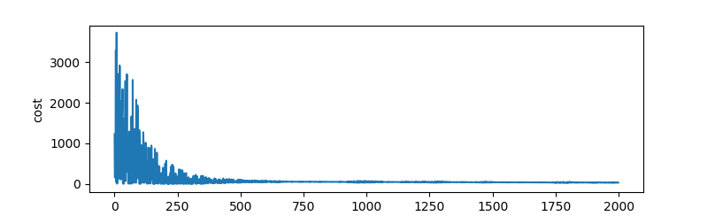

# MiniML
A lightweight computation graph library for machine learning written in pure Kotlin.

MiniML optimizes mathematical expressions by backpropagating gradients through a dynamically created expression graph.

## Example
Training a linear model:

```kotlin
val x = placeholder(zeros())
val w = variable(randoms(-10.0, 10.0))
val b = variable(randoms(-10.0, 10.0))
val expected = x * 3.0
val output = (w * x) + b
val cost = (expected - output).square()
val learningRate = 0.0001
val writer = File("cost.dat")
    .also { it.createNewFile() }
    .printWriter()

for (i in 0 until 2000) {
    x.value = randoms(-10.0, 10.0)
    val currentCost = cost.forward()
    cost.clearGradients()
    cost.backward()
    w.apply(-w.gradient!! * learningRate)
    b.apply(-b.gradient!! * learningRate)
    writer.println(currentCost)
}

writer.close()
```



In addition to operator overloading, MiniML also supports modern Kotlin features such as destructuring declarations:

```kotlin
val (rowA, rowB) = matrixOf(
    rowOf(2.0, 5.3, 7.8),
    rowOf(0.0, 0.9, 1.1)
)
val (cellA, cellB, cellC) = rowA
```
